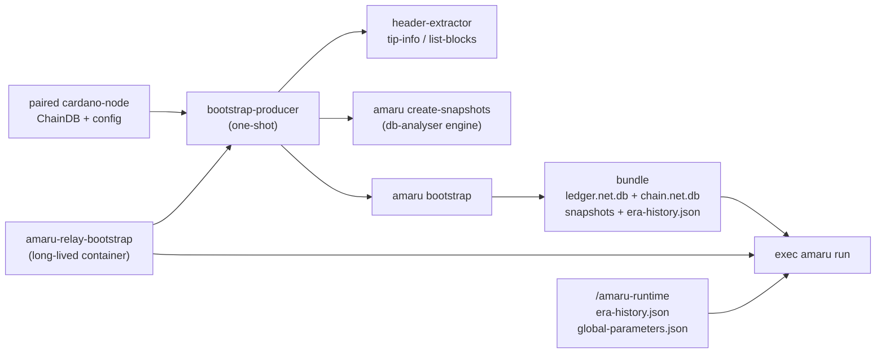

# amaru-bootstrap

Bootstrap image and tools for running [Amaru](https://github.com/pragma-org/amaru)
on custom Cardano testnets.

## What is this

Amaru cannot currently synchronise from genesis on arbitrary custom
testnets. It must start from prepared ledger and chain stores, plus the
testnet runtime parameters that tell `amaru run` how to interpret slots,
epochs, and Praos constants.

This repository builds the `ghcr.io/lambdasistemi/amaru-bootstrap-producer`
image used by the Antithesis Amaru testnets. The image carries two
entrypoints:

- `amaru-relay-bootstrap`: the Antithesis relay entrypoint. It runs as
  the long-lived `amaru-relay-N` container, writes the Antithesis startup
  marker, bootstraps from its paired `cardano-node`, then `exec`s
  `amaru run`.
- `bootstrap-producer`: the lower-level one-shot bundle producer used by
  the relay entrypoint and by local verification. It reads a cardano-node
  ChainDB, derives snapshot targets from the chain itself, runs
  `amaru create-snapshots` and `amaru bootstrap`, then exits with a
  classed status code.

The image default Docker entrypoint remains `bootstrap-producer` for
standalone compatibility. Antithesis Compose stacks must override it to
`amaru-relay-bootstrap`.

## Architecture



The production path does not use `db-synthesizer`. It reads a live
cardano-node ChainDB and runs:

1. `header-extractor tip-info` / `list-blocks` - poll the immutable DB
   until the chain is era-ready, then pick the last block of each of
   the three most recent completed epochs as snapshot targets.
2. `amaru create-snapshots` - materialize per-epoch snapshot
   directories (with packaged bootstrap headers) directly from the
   local chain DB, using `--targets-file` and `--cardano-db-dir` to
   bypass Koios and Mithril. Internally this drives the `db-analyser`
   engine, which is why `db-analyser` is bundled in the image.
3. era-history sidecars - the producer writes
   `history.<slot>.<hash>.json` next to each snapshot and an
   `era-history.json` at the bundle root, both built from the mounted
   Shelley genesis `epochLength`.
4. `amaru bootstrap` - populate `ledger.<network>.db` and
   `chain.<network>.db` from the snapshots, deriving nonces and
   importing the packaged headers.
5. atomic commit - `mv -T` of the staging directory into
   `<bundle-dir>/<network>`.

`db-synthesizer` remains in this repository only for fixtures and checks.
It fabricates ChainDB inputs for CI; it is not in the Antithesis runtime
path. `ledger-state-emitter` (the in-repo node-10.7.1 ledger projection
tool) is still built, shipped, and exposed as a flake app, but it is no
longer invoked by the producer pipeline since the migration to upstream
`create-snapshots` + `bootstrap`.

## Install

The supported runtime artifact is the published Docker image:

```text
ghcr.io/lambdasistemi/amaru-bootstrap-producer:<full-commit-sha>
```

After CI succeeds on `main`, GitHub Actions publishes a tag named by the
full commit SHA. After CI succeeds on a same-repository pull request, it
also publishes:

```text
ghcr.io/lambdasistemi/amaru-bootstrap-producer:<full-pr-head-sha>
ghcr.io/lambdasistemi/amaru-bootstrap-producer:pr-<pr-number>-<full-pr-head-sha>
```

Downstream Compose files should pin a full commit-SHA tag. The project
does not publish moving runtime tags such as `latest`.

Local image build (x86_64-linux only):

```bash
nix build .#packages.x86_64-linux.bootstrap-producer-image \
  -o result-bootstrap-producer-image
docker load -i result-bootstrap-producer-image
```

The matching CI artifact is named `bootstrap-producer-image-<github-sha>`
and contains `amaru-bootstrap-producer-<github-sha>.tar.gz`.

## Quickstart

Produce a bundle from an existing cardano-node ChainDB without Docker:

```bash
nix run .#bootstrap-producer -- \
  /path/to/cardano-node/db \
  /path/to/cardano-node/config \
  /tmp/amaru-bundle \
  testnet_42
```

That command waits for the chain to become era-ready, writes
`/tmp/amaru-bundle/testnet_42`, and exits. For the full Compose relay
shape, follow the [tutorial](docs/tutorial.md).

## Usage

All tools are exposed as flake apps:

| App | Purpose |
|-----|---------|
| `nix run .#bootstrap-producer` | One-shot bundle producer (`<chain-db> <config-dir> <bundle-dir> <network>`) |
| `nix run .#smoke-test` | Phase 0 format-compatibility smoke test (`<bundle> <out-dir>`) |
| `nix run .#header-extractor` | Immutable chain-DB queries: `tip-info`, `list-blocks`, `get-header` |
| `nix run .#ledger-state-emitter` | Standalone node-10.7.1 ledger-state projection (not in the producer pipeline) |
| `nix run .#amaru` | The pinned Amaru binary |
| `nix run .#db-synthesizer` / `.#db-analyser` / `.#snapshot-converter` | Pinned upstream consensus tools |

In the downstream
[`cardano-foundation/cardano-node-antithesis`](https://github.com/cardano-foundation/cardano-node-antithesis)
Amaru testnets, each `amaru-relay-N` container is an instance of this
image with:

```yaml
entrypoint: amaru-relay-bootstrap
environment:
  RELAY_NAME: amaru-relay-1
  AMARU_PEER: p1.example:3001
  AMARU_NETWORK: testnet_42
  AMARU_BOOTSTRAP_RETRY_SECONDS: "5"
volumes:
  - p1-state:/live:ro
  - p1-configs:/cardano/config:ro
  - ./amaru-runtime:/amaru-runtime:ro
  - amaru-startup:/startup
  - a1-state:/srv/amaru
```

The relay entrypoint writes `/startup/$RELAY_NAME.started` immediately so
the Antithesis sidecar can emit setup-complete inside the setup window.
Bootstrap then continues during the test phase. The relay loops over
`bootstrap-producer`, promotes a complete bundle into `/srv/amaru`, and
finally runs:

```text
amaru run \
  --network "$AMARU_NETWORK" \
  --ledger-dir /srv/amaru/ledger.$AMARU_NETWORK.db \
  --chain-dir /srv/amaru/chain.$AMARU_NETWORK.db \
  --era-history-file /amaru-runtime/era-history.json \
  --global-parameters-file /amaru-runtime/global-parameters.json \
  --peer-address "$AMARU_PEER"
```

The `amaru-runtime/` directory is part of the deployment contract. It
must contain:

- `era-history.json`: the custom testnet era history passed to
  `--era-history-file`.
- `global-parameters.json`: the custom testnet consensus parameters
  passed to `--global-parameters-file`.

### Compatibility target

This repository currently targets `cardano-node 10.7.1`. That is
deliberate: Cardano ledger-state CBOR changes across node releases, so
compiling against a random ledger package set is not enough. Retargeting
the producer means updating `cabal.project`, `flake.lock`, and the
documented projection in
[`specs/003-amaru-bootstrap-producer/research.md#r-011`](specs/003-amaru-bootstrap-producer/research.md).

## Documentation

The MkDocs site is published at
<https://lambdasistemi.github.io/amaru-bootstrap/> and starts at
[`docs/index.md`](docs/index.md). The current operator path is
[`docs/tutorial.md`](docs/tutorial.md), and the Antithesis-specific
contract is in [`docs/antithesis.md`](docs/antithesis.md).

For AI agents, start at [AGENTS.md](AGENTS.md).

## Development

```bash
just ci
```

`just ci` mirrors the GitHub workflow: it runs the Build Gate, runs the
Phase 0 smoke verdict, and runs the Docker-level live bootstrap verifier.
Producer-specific checks include:

```bash
nix build .#checks.x86_64-linux.bootstrap-producer-synthesized
nix build .#checks.x86_64-linux.amaru-run-bootstrap
nix build .#checks.x86_64-linux.antithesis-short-epoch-samples
nix build .#checks.x86_64-linux.antithesis-short-epoch-golden
nix build .#checks.x86_64-linux.bootstrap-producer-bats
nix build .#checks.x86_64-linux.bootstrap-producer-image
just live-bootstrap-producer
```

These checks prove bundle production, Amaru import, and Amaru startup
alignment for the pinned release boundary. They are not exhaustive
mainnet ledger-content coverage.

## License

Apache-2.0. See [`LICENSE`](LICENSE).
