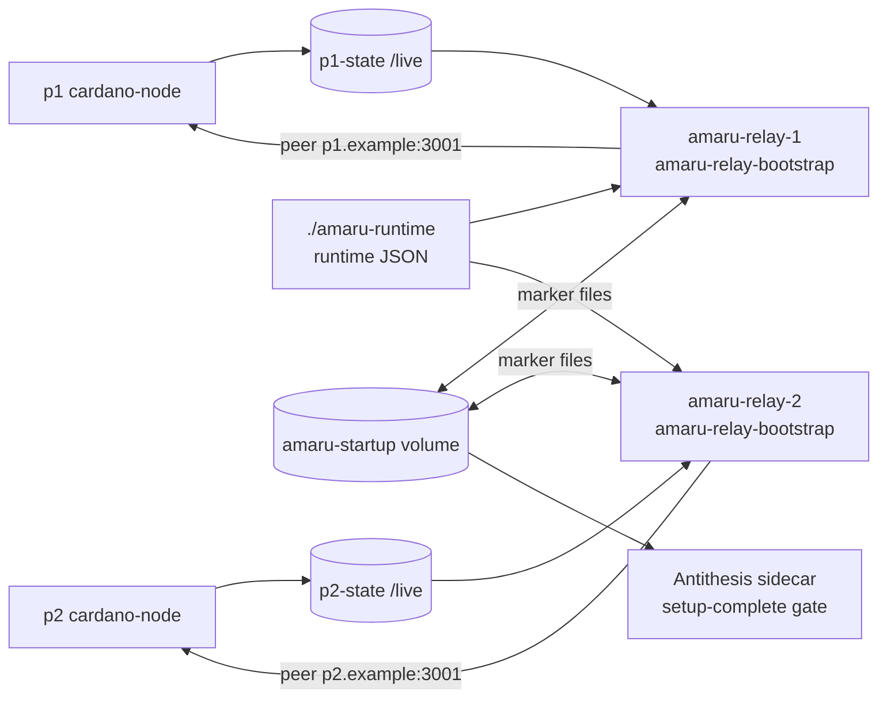

# Antithesis Deployment

The prime runtime consumer for this image is the
`cardano-foundation/cardano-node-antithesis` Amaru testnet family. Those
testnets run Amaru as relay-only nodes: no stake-pool keys, no KES or
VRF material, and no block-producing command.

## Topology

Each Amaru relay pairs with one upstream cardano-node producer:



The Amaru services do not wait for a separate `bootstrap-producer`
service to complete. Each `amaru-relay-N` container bootstraps itself
and then becomes the long-running Amaru process.

## Compose Shape

The published image contains both `/bin/bootstrap-producer` and
`/bin/amaru-relay-bootstrap`. The default image entrypoint is still
`bootstrap-producer`, so the Antithesis Compose service must override it:

```yaml
x-amaru: &amaru
  image: ghcr.io/lambdasistemi/amaru-bootstrap-producer:<full-commit-sha>
  entrypoint: amaru-relay-bootstrap
  environment:
    AMARU_LOG: info
    AMARU_COLOR: never
    AMARU_NETWORK: testnet_42
    AMARU_BOOTSTRAP_RETRY_SECONDS: "5"
  restart: always

services:
  amaru-relay-1:
    <<: *amaru
    container_name: amaru-relay-1
    hostname: amaru-relay-1.example
    depends_on:
      p1:
        condition: service_started
    environment:
      AMARU_LOG: info
      AMARU_COLOR: never
      AMARU_NETWORK: testnet_42
      AMARU_BOOTSTRAP_RETRY_SECONDS: "5"
      RELAY_NAME: amaru-relay-1
      AMARU_PEER: p1.example:3001
    volumes:
      - p1-state:/live:ro
      - p1-configs:/cardano/config:ro
      - ./amaru-runtime:/amaru-runtime:ro
      - amaru-startup:/startup
      - a1-state:/srv/amaru
```

The second relay has the same shape with `RELAY_NAME=amaru-relay-2`,
`AMARU_PEER=p2.example:3001`, and its own state volume.

## Relay Entrypoint Contract

`amaru-relay-bootstrap` accepts its required inputs through environment
variables:

| Variable | Required | Default | Meaning |
|----------|----------|---------|---------|
| `RELAY_NAME` | yes | none | Relay identity, for example `amaru-relay-1`. |
| `AMARU_PEER` | yes | none | Upstream cardano-node peer, for example `p1.example:3001`. |
| `AMARU_NETWORK` | no | `testnet_42` | Network name passed to producer and Amaru. |
| `AMARU_BOOTSTRAP_RETRY_SECONDS` | no | `20` | Sleep between bootstrap attempts. |
| `AMARU_LOG` | no | `info` | Amaru tracing filter. |
| `AMARU_RELAY_FINAL_DIR` | no | `/srv/amaru` | Final Amaru store directory. |
| `AMARU_RELAY_LIVE_DIR` | no | `/live` | Mounted cardano-node live state directory. |
| `AMARU_RELAY_CONFIG_DIR` | no | `/cardano/config/configs` | Mounted node config directory. |
| `AMARU_RELAY_RUNTIME_DIR` | no | `/amaru-runtime` | Runtime JSON directory. |
| `AMARU_RELAY_STARTUP_DIR` | no | `/startup` | Startup marker directory. |
| `AMARU_WAIT_DEADLINE_SECONDS` | no | `30` | Per-attempt era-readiness deadline exported to the producer. |
| `AMARU_CLUSTER_READY_DEADLINE_SECONDS` | no | `30` | Per-attempt chain-DB-appears deadline exported to the producer. |
| `AMARU_POLL_INTERVAL_SECONDS` | no | `5` | Producer poll interval exported to the producer. |
| `BOOTSTRAP_PRODUCER_BIN` | no | `/bin/bootstrap-producer` | Producer binary invoked by the loop. |
| `AMARU_BIN` | no | `/bin/amaru` | Amaru binary used for the final `exec`. |

The first two positional arguments may also provide `RELAY_NAME` and
`AMARU_PEER`, but environment variables win.

The wrapper deliberately tightens the producer's own deadlines (which
default to 300 s / 5400 s standalone) to 30 seconds per attempt: the
outer retry loop, which refreshes the `/live` snapshot between attempts,
is the right place to wait for the chain to mature.

## Startup Marker

The entrypoint writes this file before doing bootstrap work:

```text
/startup/$RELAY_NAME.started
```

The Antithesis sidecar watches the shared startup volume and only emits
SDK setup-complete after all required relay markers exist. The marker is
written first because the bootstrap can legitimately finish after the
short Antithesis setup window; that bootstrap work belongs to the test
phase.

This marker is not a proof that Amaru has already opened its stores or
synced. It is a deployment readiness signal that the relay container has
started and accepted its bootstrap contract. Composer commands should
assert later Amaru progress separately.

## Bootstrap Loop

On each attempt, the relay wrapper:

1. Copies the paired cardano-node `/live` state into private scratch
   space under `/srv/amaru/.work`.
2. Runs `/bin/bootstrap-producer <scratch-state> <config> <scratch-out>
   <network>`.
3. Retries transient producer exits `1`, `2`, `5`, `6`, `7`, and `8`.
4. Promotes a complete produced bundle into `/srv/amaru`.
5. Uses `/srv/amaru/.bootstrap-complete` as the relay-local sentinel.

All wrapper, producer, and Amaru output goes to container stdout/stderr.
The wrapper prefixes its own lines with `[$RELAY_NAME]` and producer
lines with `[$RELAY_NAME bootstrap-producer]` so Antithesis Logs Explorer
queries can separate relay instances.

## Runtime Parameter Files

`amaru run` needs runtime parameters for custom generated testnets. The
relay entrypoint reads them from `/amaru-runtime` by default:

```text
/amaru-runtime/
|-- era-history.json
`-- global-parameters.json
```

It passes them directly to Amaru:

```text
--era-history-file /amaru-runtime/era-history.json
--global-parameters-file /amaru-runtime/global-parameters.json
```

Keep these files aligned with the `testnet.yaml` and genesis files used
by the cardano-node configurator. A mismatch can make Amaru interpret a
short-epoch testnet with mainnet-like epoch boundaries or wrong Praos
parameters, which surfaces later as startup, nonce, or VRF verification
failures.

## What Not To Wire

Do not wire Amaru relays behind:

```yaml
depends_on:
  bootstrap-producer:
    condition: service_completed_successfully
```

That was the old one-shot service model. In relay mode the
`amaru-relay-N` container never exits successfully after producing a
bundle; it continues by replacing itself with `amaru run`.
