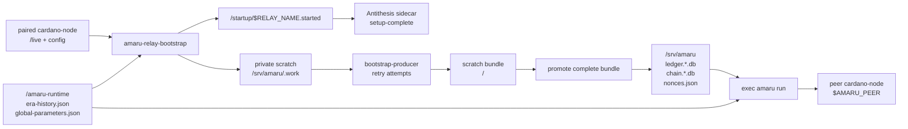
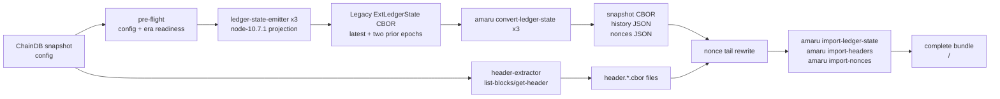
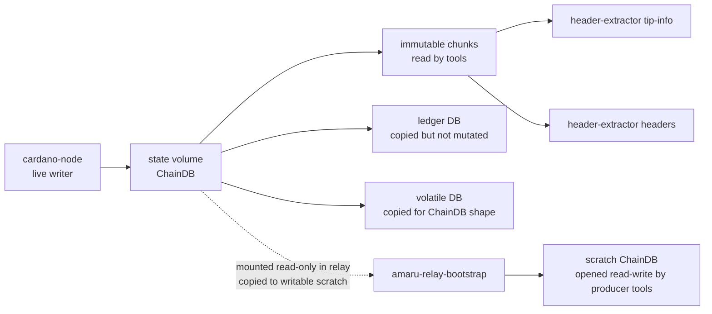
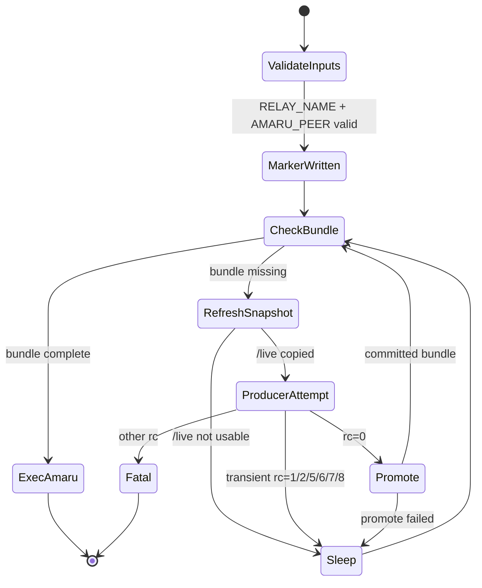
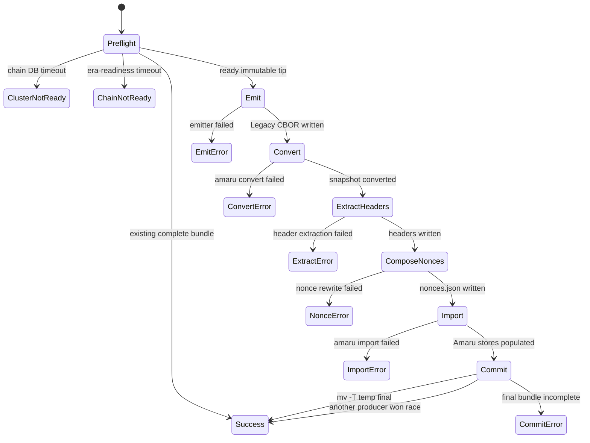
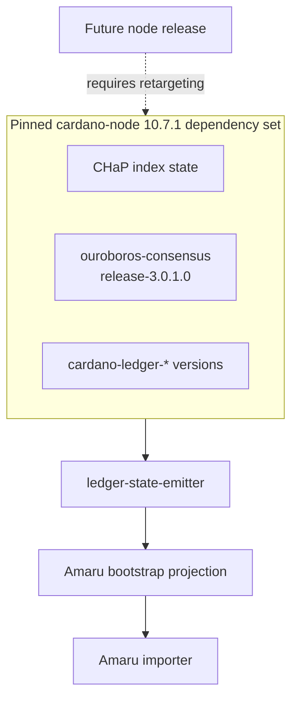
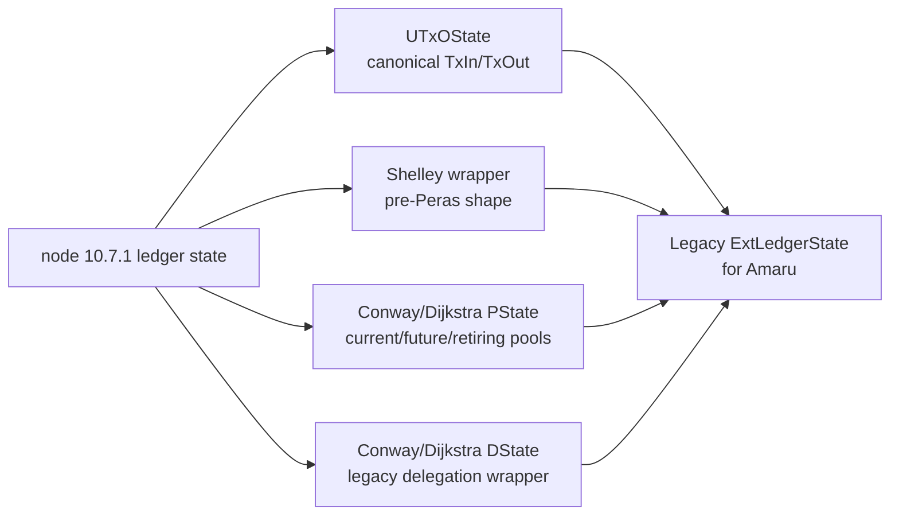
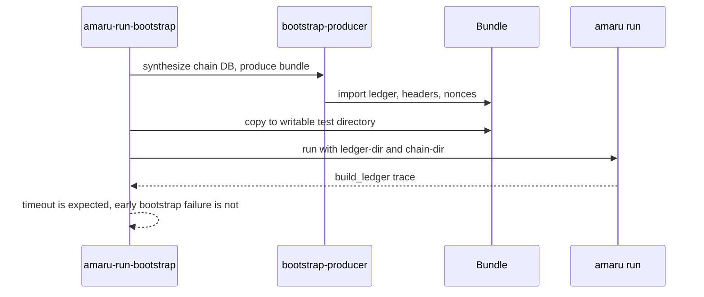

# Architecture

The repository has two layers:

- `amaru-relay-bootstrap`: the long-lived Antithesis relay entrypoint.
- `bootstrap-producer`: the one-shot producer primitive called by the
  relay wrapper and by local checks.

The critical code boundary is still release-pinned ledger projection:
`ledger-state-emitter` targets one cardano-node release at a time. This
branch targets `cardano-node 10.7.1`.

## Relay Runtime



The relay writes the startup marker before bootstrap work. That lets the
Antithesis setup phase complete while the bootstrap itself continues in
the test phase. The marker is not an Amaru-sync proof; it is a container
startup contract.

There is no downstream Compose service waiting on
`service_completed_successfully` in relay mode. The relay container does
not stop after bootstrap; it `exec`s `amaru run`.

## Bootstrap Producer Pipeline



In standalone mode the producer writes `<bundle>/<network>`. In relay
mode it writes to scratch, and the wrapper promotes the contents of
`<scratch-out>/<network>` into `/srv/amaru` so `amaru run` can open:

```text
/srv/amaru/
|-- chain.<network>.db/
|-- ledger.<network>.db/
|-- snapshots/
|-- nonces.json
`-- headers/
```

## Live ChainDB Contract



The one-shot `bootstrap-producer` still needs a writable ChainDB path
because node-10.7.1's consensus ImmutableDB validation path opens chunk
files through APIs that reject a read-only filesystem. The relay wrapper
therefore copies the paired cardano-node `/live` state into private
writable scratch before invoking the producer. The producer behavior is
immutable-only: readiness comes from immutable chunks, and the ledger
replay uses an in-memory LedgerDB backend rather than flushing into the
node-owned LedgerDB.

## Relay State Machine



The retry loop belongs in the relay entrypoint, not in Compose
dependency semantics. This matters under Antithesis faults: a short,
failed producer attempt should refresh from a newer `/live` snapshot
instead of blocking the whole setup behind a one-shot service.

## Producer State Machine



## Runtime Parameters

The relay passes deployment-provided runtime JSON to `amaru run`:

```text
--era-history /amaru-runtime/era-history.json
# global-parameters.json is exported as AMARU_GLOBAL_* (amaru run --help-global-parameters)
```

These files must match the custom testnet genesis/config used by the
paired cardano-node. They are separate from the snapshot sidecar history
files that `amaru convert-ledger-state` writes next to each converted
snapshot.

## Node-Release Boundary



Retargeting to another node release is an explicit project task. It is
not just a Cabal compile check: the emitted ledger-state shape has to
match what Amaru imports for that release.

## Ledger-State Projection



The projection preserves the fields Amaru imports and omits node-side
acceleration or wrapper fields that Amaru does not consume during
bootstrap.

## CI Startup Proof



The CI proof is deliberately peer-free: it does not prove live chain
synchronisation. It proves the produced stores are sufficient for Amaru
to open its ledger and chain state and enter node startup.
