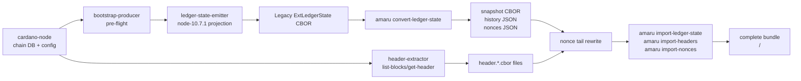
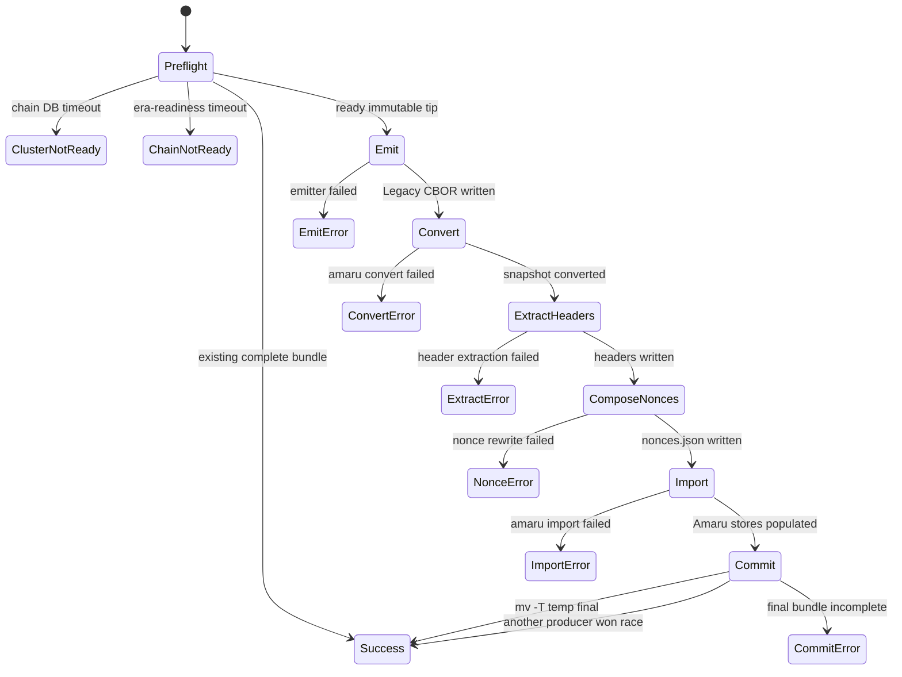
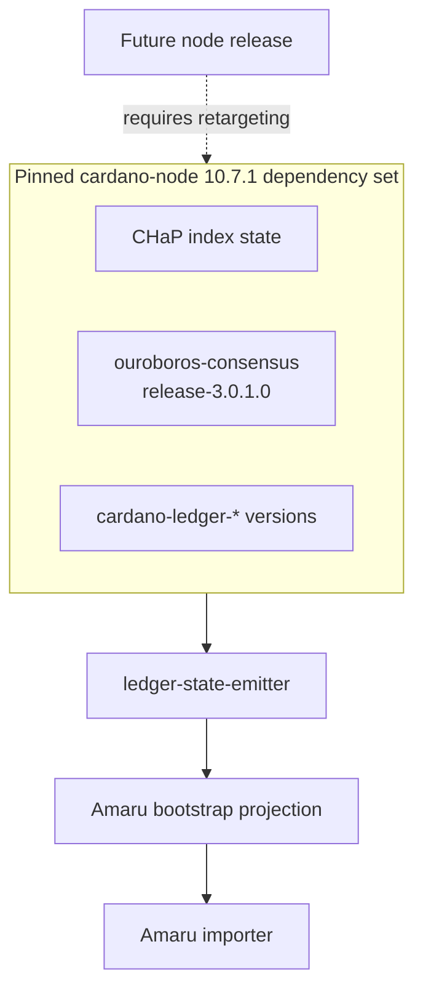
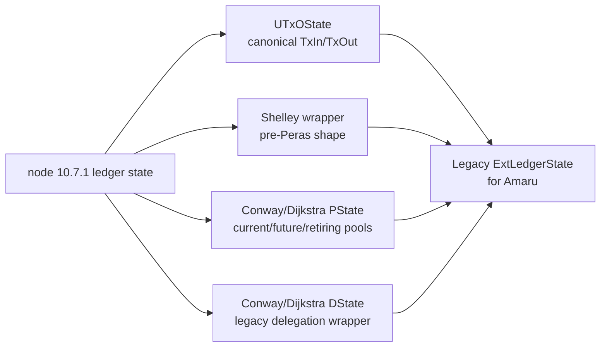
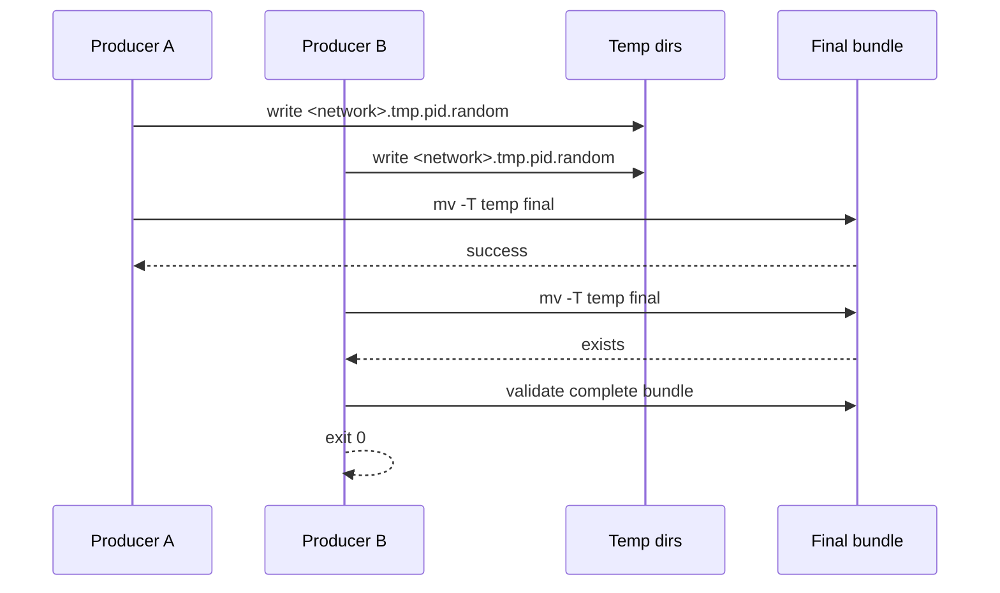

# Architecture

The producer is intentionally a small orchestration layer around
release-pinned tools. The critical design boundary is that
`ledger-state-emitter` targets one cardano-node release at a time; the
current branch targets `cardano-node 10.7.1`.

## Runtime Components

The producer's exit code is the synchronization primitive for Docker
Compose. Downstream Amaru services depend on
`service_completed_successfully` and start only after the bundle exists.

## State Machine

## Node-Release Boundary

Retargeting to another node release is an explicit project task. It is
not just a Cabal compile check: the emitted ledger-state shape has to
match what Amaru imports for that release.

## Ledger-State Projection

The projection preserves the fields Amaru imports and omits node-side
acceleration or wrapper fields that Amaru does not consume during
bootstrap.

## Concurrency

There is no shared temp directory. Concurrent producers cannot corrupt
each other's intermediate files; one wins the atomic rename and the
others accept the completed bundle.
