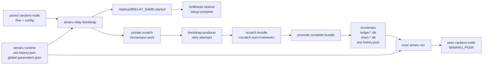
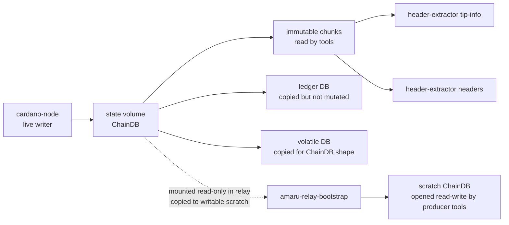
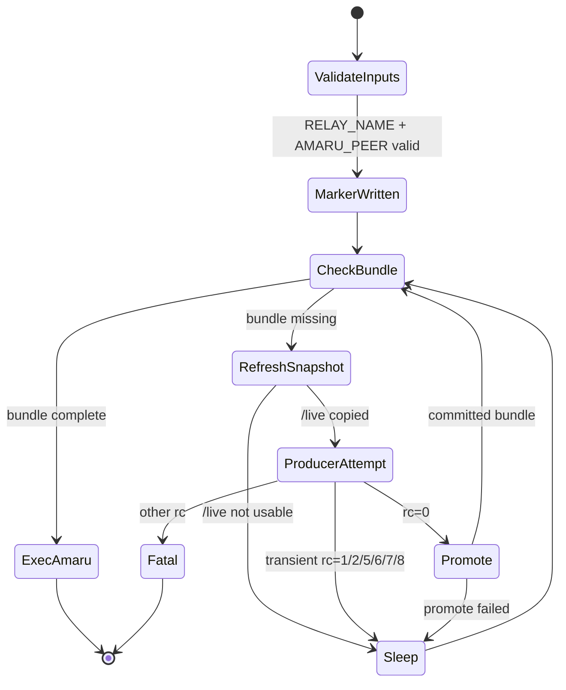
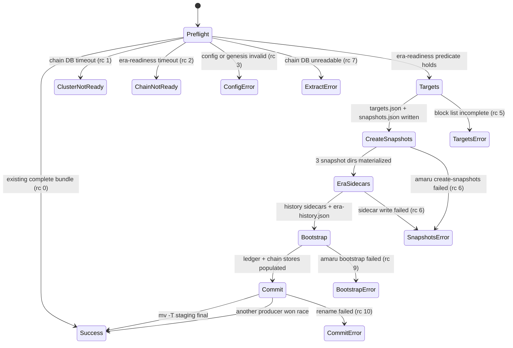
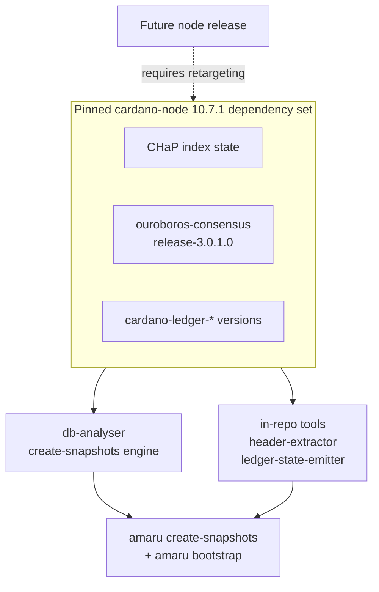
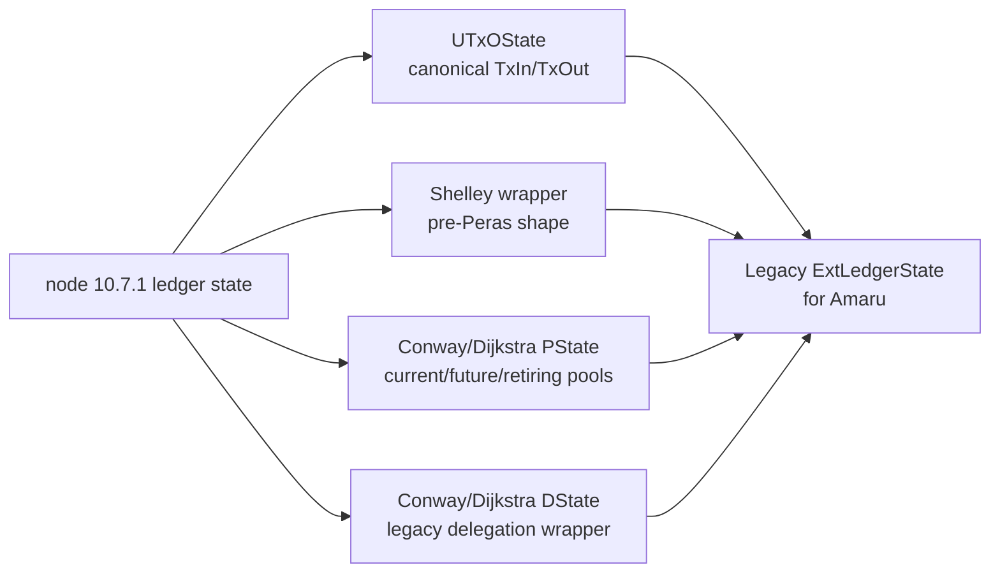
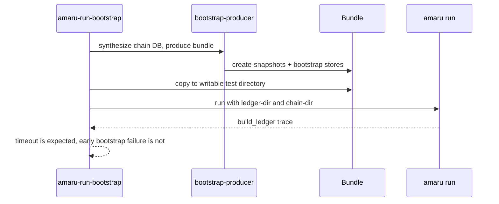

# Architecture

The repository has two layers:

- `amaru-relay-bootstrap`: the long-lived Antithesis relay entrypoint.
- `bootstrap-producer`: the one-shot producer primitive called by the
  relay wrapper and by local checks.

The critical code boundary is still the release-pinned ledger-state
format: the whole toolset (`header-extractor`, the `db-analyser` engine
that `amaru create-snapshots` drives, and the standalone
`ledger-state-emitter`) targets one cardano-node release at a time. This
branch targets `cardano-node 10.7.1`.

## Relay Runtime



The relay writes the startup marker before bootstrap work. That lets the
Antithesis setup phase complete while the bootstrap itself continues in
the test phase. The marker is not an Amaru-sync proof; it is a container
startup contract.

There is no downstream Compose service waiting on
`service_completed_successfully` in relay mode. The relay container does
not stop after bootstrap; it `exec`s `amaru run`.

## Bootstrap Producer Pipeline

```mermaid
flowchart LR
    mount["ChainDB snapshot\nconfig"] --> preflight["pre-flight\nconfig + era readiness\nheader-extractor tip-info"]
    preflight --> blocks["preflight block list\nheader-extractor list-blocks"]
    blocks --> targets["targets.json\nsnapshots.json\nlast block of each of the\n3 completed epochs"]
    targets --> snaps["amaru create-snapshots\ndb-analyser engine\n--targets-file + --cardano-db-dir"]
    snaps --> snapdirs["snapshots/&lt;net&gt;/&lt;slot&gt;.&lt;hash&gt;/\nwith packaged bootstrap headers"]
    snapdirs --> sidecars["era-history sidecars\nhistory.&lt;slot&gt;.&lt;hash&gt;.json\n+ bundle era-history.json"]
    sidecars --> boot["amaru bootstrap\nderives nonces\nimports packaged headers"]
    boot --> stores["ledger.&lt;net&gt;.db\nchain.&lt;net&gt;.db"]
    stores --> commit["mv -T staging final\natomic commit"]
    commit --> bundle["complete bundle\n&lt;bundle&gt;/&lt;network&gt;"]
```



In standalone mode the producer writes `<bundle>/<network>`. In relay
mode it writes to scratch, and the wrapper promotes the contents of
`<scratch-out>/<network>` into `/srv/amaru` so `amaru run` can open:

```text
/srv/amaru/
|-- chain.<network>.db/
|-- ledger.<network>.db/
|-- snapshots/
`-- era-history.json
```

Nonces and bootstrap headers are baked into `chain.<network>.db` by
`amaru bootstrap`; they are no longer separate bundle artefacts. The
`snapshots/<network>/` directory keeps the materialized epoch snapshots
and their era-history sidecars for re-bootstrap; `era-history.json` at
the bundle root is the consume-time override for
`amaru run --era-history-file`.

## Live ChainDB Contract



The one-shot `bootstrap-producer` still needs a writable ChainDB path
because node-10.7.1's consensus ImmutableDB validation path opens chunk
files through APIs that reject a read-only filesystem. The relay wrapper
therefore copies the paired cardano-node `/live` state into private
writable scratch before invoking the producer. The producer behavior is
immutable-only: readiness comes from immutable chunks, and
`amaru create-snapshots` is given an isolated `--cardano-db-dir` view in
which the immutable chunks are symlinked from the source ChainDB while
the ledger snapshots its `db-analyser` engine materializes land in
producer-owned writable directories. The producer never mutates the
source ChainDB, so concurrent producers can run against the same chain.

## Relay State Machine



The retry loop belongs in the relay entrypoint, not in Compose
dependency semantics. This matters under Antithesis faults: a short,
failed producer attempt should refresh from a newer `/live` snapshot
instead of blocking the whole setup behind a one-shot service.

## Producer State Machine



Any other uncaught failure exits with `64 + rc` via the internal-error
trap. The relay wrapper treats exit codes 1, 2, 5, 6, 7, and 8 as
transient and retries; 0 promotes; anything else is fatal.

## Runtime Parameters

The relay passes deployment-provided runtime JSON to `amaru run`:

```text
--era-history-file /amaru-runtime/era-history.json
--global-parameters-file /amaru-runtime/global-parameters.json
```

These files must match the custom testnet genesis/config used by the
paired cardano-node. They are separate from the
`history.<slot>.<hash>.json` sidecars the producer writes next to each
snapshot directory (consumed by `amaru bootstrap`) and from the
`era-history.json` it writes at the bundle root (the consume-time
override for `amaru run --era-history-file`). All three documents are
built from the same genesis `epochLength`.

## Node-Release Boundary



Retargeting to another node release is an explicit project task. It is
not just a Cabal compile check: the ledger-state CBOR that the pinned
tools read and that Amaru imports has to match for that release.

## Ledger-State Projection (standalone emitter)



The projection preserves the fields Amaru imports and omits node-side
acceleration or wrapper fields that Amaru does not consume during
bootstrap.

`ledger-state-emitter` implements this projection as an in-repo
executable. Since the producer migrated to upstream
`amaru create-snapshots` + `amaru bootstrap`, the emitter is no longer
part of the producer pipeline; it remains in the image and as the flake
app `nix run .#ledger-state-emitter` for standalone snapshot emission
and debugging against the pinned node release.

## CI Startup Proof



The CI proof is deliberately peer-free: it does not prove live chain
synchronisation. It proves the produced stores are sufficient for Amaru
to open its ledger and chain state and enter node startup.
