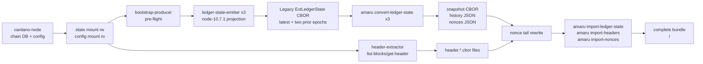
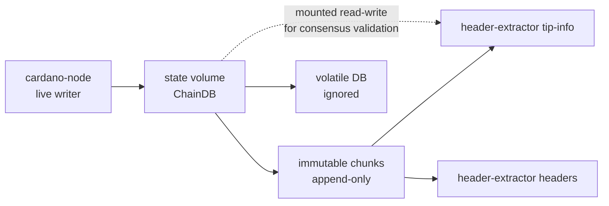
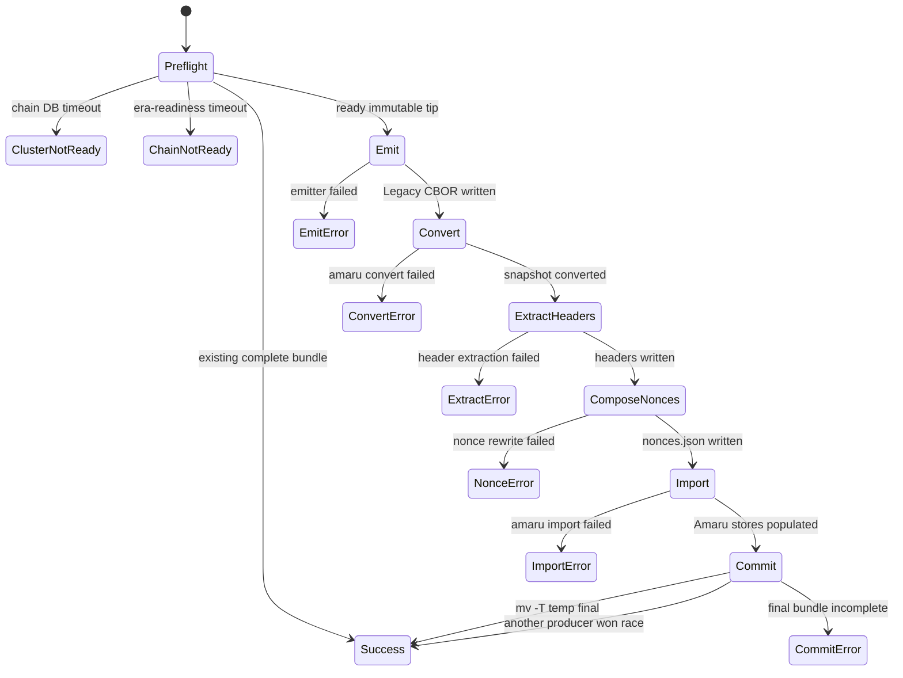
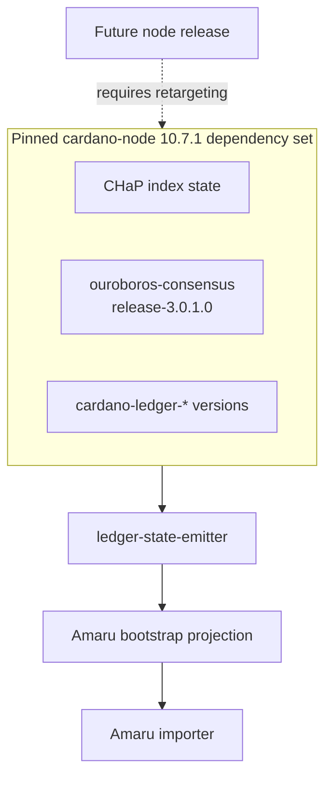
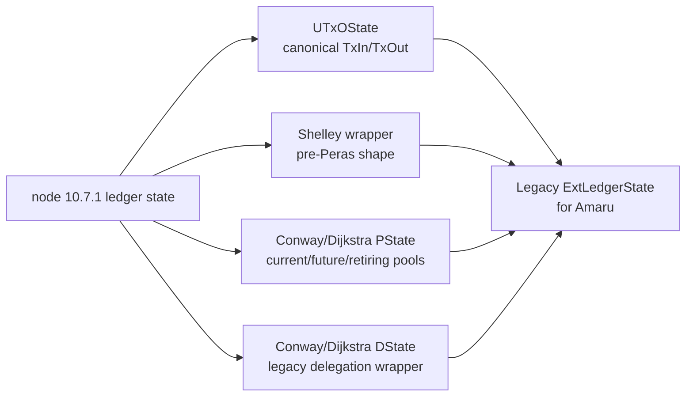
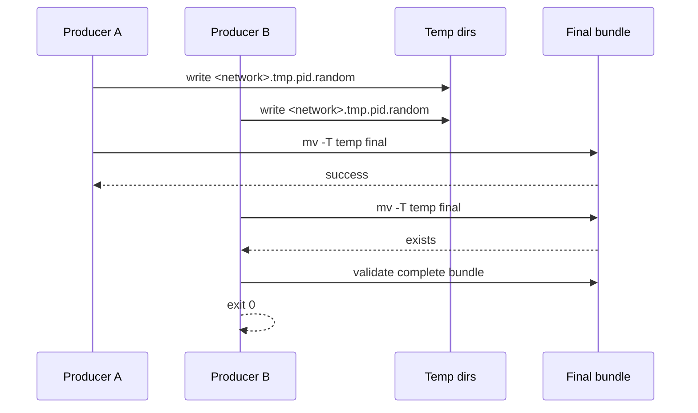

# Architecture

The producer is intentionally a small orchestration layer around
release-pinned tools. The critical design boundary is that
`ledger-state-emitter` targets one cardano-node release at a time; the
current branch targets `cardano-node 10.7.1`.

## Runtime Components



The producer's exit code is the synchronization primitive for Docker
Compose. Downstream Amaru services depend on
`service_completed_successfully` and start only after the bundle exists.

## Live ChainDB Contract



The bootstrap-producer's semantic contract is immutable-only access:
readiness is derived from the immutable tip and header extraction walks
immutable chunks. The Docker mount is still read-write because
node-10.7.1's consensus ImmutableDB validation path opens chunk files
through APIs that reject a read-only filesystem. The producer does not
use volatile DB state as a readiness source.

## State Machine



## Node-Release Boundary



Retargeting to another node release is an explicit project task. It is
not just a Cabal compile check: the emitted ledger-state shape has to
match what Amaru imports for that release.

## Ledger-State Projection



The projection preserves the fields Amaru imports and omits node-side
acceleration or wrapper fields that Amaru does not consume during
bootstrap.

## Concurrency



There is no shared temp directory. Concurrent producers cannot corrupt
each other's intermediate files; one wins the atomic rename and the
others accept the completed bundle.

## CI Startup Proof

```mermaid
sequenceDiagram
    participant Check as amaru-run-bootstrap
    participant Producer as bootstrap-producer
    participant Bundle as Bundle
    participant Amaru as amaru run

    Check->>Producer: synthesize chain DB, produce bundle
    Producer->>Bundle: import ledger, headers, nonces
    Check->>Bundle: copy to writable test directory
    Check->>Amaru: run with ledger-dir and chain-dir
    Amaru-->>Check: build_ledger trace
    Check-->>Check: timeout is expected; early bootstrap failure is not
```

The CI proof is deliberately peerless: it does not prove live chain
synchronisation. It proves the produced stores are sufficient for Amaru
to open its ledger and chain state and enter node startup.
